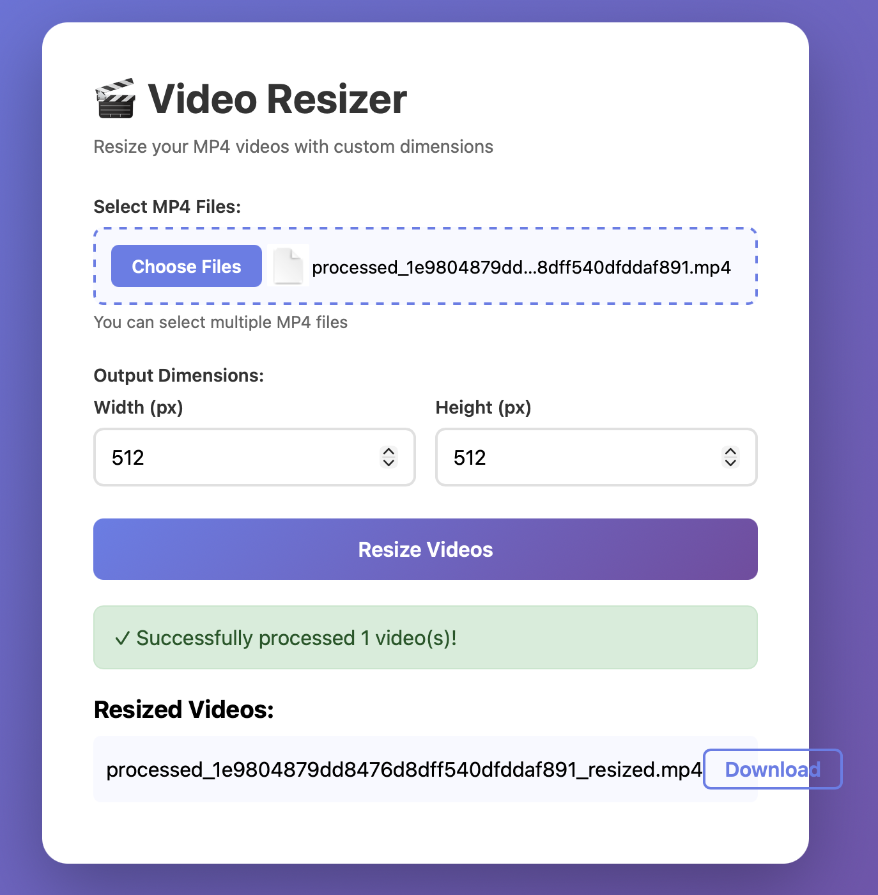

# Video Resizer Web UI

A simple web interface for resizing MP4 videos locally.

## UI Screenshot



## Installation

1. Install required Python packages:
```bash
pip install -r requirements.txt
```

2. Make sure ffmpeg is installed on your system:
   - macOS: `brew install ffmpeg`
   - Linux: `sudo apt install ffmpeg`
   - Windows: Download from https://ffmpeg.org/

## Usage

1. Start the web server:
```bash
python web_ui.py
```

2. Open your browser and navigate to:
```
http://localhost:5002
```

3. Use the web interface to:
   - Select one or multiple MP4 files
   - Set custom width and height dimensions
   - Click "Resize Videos" to process
   - Download the resized videos

## Features

- Select multiple MP4 files at once
- Custom dimensions (width x height)
- Real-time progress feedback
- Download resized videos directly from the browser
- All resized videos are saved in the `resized_videos` folder

## Notes

- Maximum file size: 500MB per file
- Only MP4 format is supported
- Uploaded files are automatically deleted after processing
- Resized videos are kept in the `resized_videos` folder
